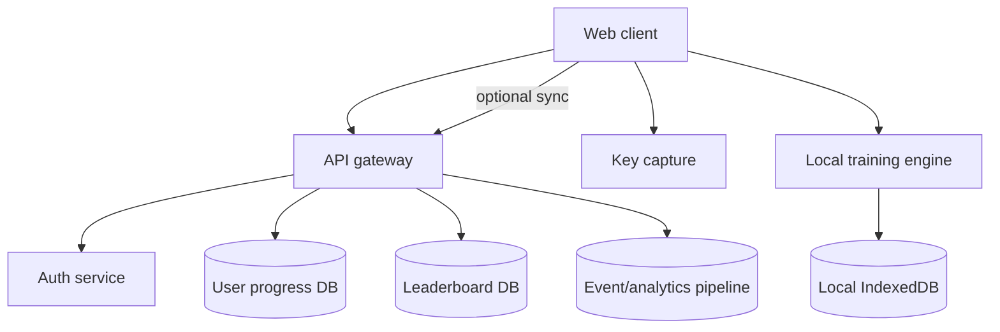
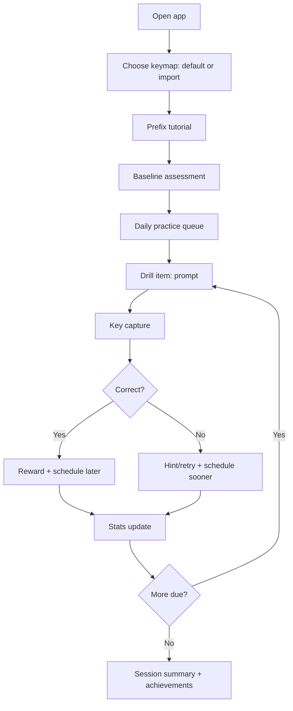

# Designing a Gamified tmux Trainer Web App

## Executive summary

A gamified tmux trainer web app can be unusually effective because tmux usage is dominated by **short, repeatable keystroke sequences** (often “prefix + key”), and the learning objective is primarily **automatic recall under time pressure** rather than conceptual reasoning. tmux’s official manual documents a large set of default key bindings and the command model (clients → sessions → windows → panes), giving you an authoritative, version-stable content base to encode as drills and simulations. citeturn7view0turn16view0  

The most important product decision is whether you are training a **fixed keymap** (the default bindings most beginners encounter) or a **user-imported keymap** (many tmux users change the prefix and pane-navigation keys). tmux explicitly supports listing and rebinding keys via key tables (root/prefix/copy-mode/copy-mode-vi), and exposes `list-keys` output in a machine-parseable form (bind-key commands), so a “paste-your-bindings” import path is both feasible and aligns with how tmux itself represents bindings. citeturn8view0turn7view0  

For learning efficacy, you should build around two evidence-backed principles: **spaced repetition** (distributed practice over time) and **retrieval practice** (testing beats restudy). These effects are supported by large research bases, including meta-analysis on spacing effects and controlled studies on the “testing effect.” citeturn2search0turn2search5turn17search4turn17search33  

A pragmatic architecture is **client-first** (static hosting + IndexedDB persistence + optional PWA caching). This yields near-zero operating cost and easy deployment while still supporting rich personalization and offline practice. IndexedDB is explicitly designed for persistent structured client-side storage, and service workers can enable offline-first behavior when served over HTTPS. citeturn3search1turn3search8turn11search0turn11search4  

If you later want **leaderboards, multi-device sync, accounts, tournaments**, you can add a backend without rewriting your core training logic by separating (a) deterministic evaluation/scoring from (b) identity + social + analytics services. This “core offline, extras online” split also supports privacy-friendly defaults. citeturn11search7turn3search8  

Key primary sources (direct links, plus many more embedded as citations):

```text
tmux manual page (tmux(1)): https://man7.org/linux/man-pages/man1/tmux.1.html
tmux wiki “Getting Started”: https://github.com/tmux/tmux/wiki/Getting-Started
tmuxtutor (vimtutor-style tmux tutorial): https://github.com/perlpunk/tmuxtutor
ShortcutFoo tmux dojo (spaced repetition drills): https://www.shortcutfoo.com/app/dojos/tmux
WCAG 2.2: https://www.w3.org/TR/WCAG22/
ARIA Authoring Practices Guide (APG): https://www.w3.org/WAI/ARIA/apg/
MDN KeyboardEvent: https://developer.mozilla.org/en-US/docs/Web/API/KeyboardEvent
MDN IndexedDB: https://developer.mozilla.org/en-US/docs/Web/API/IndexedDB_API
```

## tmux command and shortcut inventory for training

tmux’s conceptual hierarchy is foundational training content: a **server** manages **clients**, which attach to **sessions**; sessions contain **windows**; windows contain **panes**. This structure appears prominently in the tmux manual and in tmux’s official Getting Started wiki. citeturn16view0turn4search29  

image_group{"layout":"carousel","aspect_ratio":"16:9","query":["tmux panes split screenshot","tmux session window pane diagram","tmux status bar window list screenshot"],"num_per_query":1}  

The table below proposes an “essential inventory” optimized for a beginner memory app. It is **anchored in default tmux bindings** (authoritative, stable) and split by (a) likely frequency for early users and (b) skill difficulty. The default bindings list is directly documented in `tmux(1)`; copy-mode tables and key-table concepts are documented in the tmux wiki. citeturn7view0turn8view0  

### Essential shortcuts and commands to include

**Legend:** “Prefix” is `C-b` by default. The sequence `C-b c` means “press Ctrl-b, release, then press c.” citeturn7view0turn0search6turn0search15  

| Tier | Frequency focus | What to train | Default key / command | Why it matters for beginners |
|---|---|---|---|---|
| Core | Very high | Identify prefix + “what is tmux listening for” | Prefix is `C-b`; help is `C-b ?` | Prefix is the gateway mechanic; `?` is the built-in escape hatch for self-service learning. citeturn7view0 |
| Core | Very high | Detach/reattach mental model | Detach `C-b d`; attach via `tmux attach-session` | Detach/reattach is tmux’s “superpower” for long-running work (esp. remote sessions). citeturn7view0turn16view1 |
| Core | Very high | Create/switch windows | New window `C-b c`; next `C-b n`; prev `C-b p`; by index `C-b 0..9` | Window creation/navigation is the first branching structure users rely on daily. citeturn7view0turn16view0 |
| Core | Very high | Split panes | Split vertical `C-b %`; split horizontal `C-b "` | Panes are the main workflow accelerator for side-by-side terminal tasks. citeturn7view0 |
| Core | Very high | Move between panes | `C-b` + arrow keys | Spatial navigation is a core muscle-memory loop. citeturn7view0 |
| Core | Very high | Close panes/windows safely | Kill pane `C-b x`; kill window `C-b &` | Beginners often create layout clutter; reliable “undo-by-kill” is confidence-building. citeturn7view0 |
| Core | High | Rename window/session | Rename window `C-b ,`; rename session `C-b $`; `rename-session` | Naming prevents “where am I?” confusion once you have multiple sessions/windows. citeturn7view0turn16view3 |
| Core | High | Command prompt entry | `C-b :` | Many advanced operations are reachable from the command prompt, even if unbound. citeturn7view0 |
| Regular | High | Choose session/window interactively | Choose session `C-b s`; choose window `C-b w` | Interactive choosers reduce reliance on memorizing numeric indices early. citeturn7view0 |
| Regular | High | Zoom a pane | `C-b z` | Zoom provides a “focus mode” without destroying layout. citeturn7view0 |
| Regular | Medium | Resize panes | `C-b` + `C-Arrow` (1 cell), `C-b` + `M-Arrow` (5 cells) | Resizing is high-value but slightly more complex for the browser to capture (Ctrl/Alt combos). citeturn7view0 |
| Regular | Medium | Layout cycling/presets | `C-b Space` (next layout); `C-b M-1..M-7` presets | Layouts let users recover from messy splits quickly. citeturn7view0 |
| Regular | Medium | Copy mode entry + paste | Copy mode `C-b [`; paste `C-b ]`; list buffers `C-b #` | Copy/paste is a major beginner pain point; tmux uses its own buffer model. citeturn7view0 |
| Regular | Medium | Find/search | Search open windows `C-b f` | Helps users locate output across many panes/windows. citeturn7view0 |
| Regular | Medium | Last pane/window | Last pane `C-b ;`; last window `C-b l` | “Toggle back” is a frequent micro-action in real workflows. citeturn7view0 |
| Power | Medium | Swap panes | Swap with prev `C-b {`; swap with next `C-b }` | Introduces layout manipulation without re-splitting. citeturn7view0 |
| Power | Medium | Break pane out | `C-b !` | Encourages flexible refactoring of terminal layout. citeturn7view0 |
| Power | Lower | Rotate panes | `C-b C-o` (forward), `C-b M-o` (backward) | Lower frequency, but supports “fix layout quickly” workflows. citeturn7view0 |
| Advanced | Lower | List keys / introspection | `C-b ?`; CLI/command prompt `list-keys` | Enables user-imported keymaps and explainability in-app. citeturn7view0turn8view0 |
| Advanced | Lower | Key tables + rebinding | `bind-key`, `unbind-key`; key tables root/prefix/copy-mode* | Critical if your trainer supports custom configurations and copy-mode variants. citeturn7view0turn8view0 |
| Advanced | Lower | Copy-mode variants (emacs vs vi) | `mode-keys` toggles copy-mode tables | Copy mode is where many users diverge; your trainer should let users choose/learn both. citeturn8view0turn0search4 |

### Copy-mode specifics you should treat as a separate “module”

Copy mode in practice becomes its own skill tree. tmux’s wiki documents that copy mode uses emacs-style keys by default (unless environment variables indicate `vi`), and explicitly defines separate key tables (`copy-mode` and `copy-mode-vi`) plus representative bindings (movement, selection, exit). citeturn8view0  

For a beginner trainer, it’s usually better to keep copy-mode drills **opt-in** (or unlocked after basic pane/window competency) because copy mode introduces (a) different key semantics and (b) a second “mode” mental model—both of which can overwhelm early learning. The underlying key-table structure and configuration options (`mode-keys`, `status-keys`) are clearly described in tmux’s wiki. citeturn8view0turn0search4  

## Landscape of existing trainers and gaps

There are existing tools that help people learn tmux, but most sit at one of two extremes: **static cheat sheets** (good reference, weak retention) or **interactive training environments** that are effective but often paywalled or not tmux-native. The most relevant “training-like” products for tmux include:

- **ShortcutFoo’s tmux dojo**, which explicitly frames itself as “learn tmux with spaced repetition” and structures sessions/lessons/tests, but is partly gated behind pricing tiers. citeturn5search0turn5search6  
- **tmuxtutor**, a tutorial explicitly inspired by `vimtutor` and delivered as a stepwise practice text, but it’s not fundamentally a game and typically doesn’t adapt based on performance. citeturn4search1turn4search5turn0search6  
- **Interactive/visual cheat sheets** (including a community “interactive tmux cheatsheet” shared in tmux forums), which improve discoverability but generally don’t implement recall testing, personalization, or scheduling. citeturn4search11turn4search2  

### Comparative snapshot of existing tools

| Tool | What it is | Strengths | Gaps your app can fill |
|---|---|---|---|
| ShortcutFoo tmux dojo | Web drills + tests with spaced repetition framing | Structured practice loop and “dojo” gamification; clear sessions/lessons. citeturn5search0turn5search6 | Paywall limits content; typically not an open, extensible tmux simulator; unclear support for importing personal keymaps. citeturn5search0turn5search9 |
| tmuxtutor | `vimtutor`-inspired guided tutorial | Linear, beginner-friendly explanations; open-source distribution on GitHub. citeturn0search2turn4search5 | Mostly linear rather than adaptive; limited “game loop”; typically no timing/scoring/analytics layer. citeturn0search2 |
| tmuxcheatsheet.com | Comprehensive cheat sheet | Broad coverage; quick reference for sessions/windows/panes. citeturn4search2 | Reference ≠ retention; no retrieval practice scheduling or mastery model. citeturn4search2 |
| Interactive tmux cheatsheet (community project) | Visual/interactive reference | Better “scanability” than text lists; community interest indicates demand. citeturn4search11 | Typically not adaptive; usually not a training simulator with drills and scoring. citeturn4search11 |
| Built-in tmux “help” list | tmux’s own key listing | Always accurate for a given config; great onboarding tool (`C-b ?`). citeturn7view0turn8view0 | Not optimized for learning science (spacing/testing), and not “web accessible” for practice away from terminal. citeturn7view0turn2search5turn17search4 |

### High-value gaps to target

A differentiating tmux trainer should focus on gaps that are both pedagogically meaningful and technically feasible:

First, **custom keymap support** is the biggest practical gap. tmux is designed to rebind keys (`bind-key` / `unbind-key`) and to list all bindings (`list-keys`) with explicit key tables; a trainer that can ingest user bindings avoids the common issue where beginners learn defaults but their workplace dotfiles differ. citeturn7view0turn8view0  

Second, most tools teach “what keys exist,” but not **layout reasoning**. A game-like simulation that visually shows windows/panes and animates operations (split, swap, zoom) can teach *why* to use a command, not just *what*. The default bindings list explicitly includes layout primitives (split, swap, zoom, layout presets), so you can model these operations deterministically in a browser. citeturn7view0  

Third, few tmux trainers combine **retrieval practice + spacing** with **timed “speed runs”** and **adaptive difficulty**. The learning literature supports spacing and testing effects; combining them with performance modeling (accuracy, latency, error types) lets you personalize the review schedule and challenge selection. citeturn2search0turn2search5turn17search4turn17search33  

## Front-end technology recommendations

A tmux trainer is “keyboard-first UI,” so the best frameworks are those that make it easy to: (a) capture and normalize key input, (b) manage structured state (progress, scheduling, content graph), (c) persist locally, and (d) animate UI changes (pane splits and transitions).

### Framework comparison

All major frameworks can work; the trade is mostly about ecosystem, code organization, and how quickly you can build a polished interaction model.

| Choice | Why it fits this app | Notable pros | Notable cons | Best-fit use case |
|---|---|---|---|---|
| React + Vite | React is a UI library built from components; Vite offers a fast dev/build workflow. citeturn15search11turn15search3turn15search7 | Huge ecosystem; strong component patterns for complex stateful UIs; easy to integrate keyboard hooks and animation libs. citeturn15search4turn1search0turn10search0 | You must choose more “by convention” (state, routing, patterns); can accrue boilerplate if undisciplined. citeturn9search20turn9search12 | Most common hiring-market stack; best if you want maximum library optionality. citeturn15search11 |
| Vue + Vite | Vue provides declarative rendering and built-in reactivity; Vite-first workflows are common. citeturn14search23turn15search3 | Strong “batteries included” feel; VueUse provides ergonomic key-combo tools; Pinia provides an official store pattern. citeturn1search1turn9search2turn14search8 | Some keyboard/animation ecosystem choices differ from React’s; fewer “keyboard-heavy app” reference implementations. citeturn1search1turn10search2 | Excellent if you want a cohesive, Vue-native stack with fewer decisions. citeturn9search2turn14search23 |
| SvelteKit | Svelte compiles components; SvelteKit is an app framework for building robust web apps with Svelte. citeturn15search1turn15search2 | Very concise component code; built-in stores; SvelteKit provides routing + production scaffolding. citeturn1search6turn15search2turn14search5 | Smaller ecosystem than React/Vue (though improving); fewer off-the-shelf training app templates. citeturn15search2turn1search6 | Great for building the “tmux simulator” UI with minimal code and fast iteration. citeturn15search1turn15search2 |

### Keyboard input capture and normalization libraries

You can implement keyboard capture manually with `keydown` listeners, but a dedicated library can reduce edge cases for sequences, modifier normalization, and display formatting.

- **Native KeyboardEvent approach (recommended baseline)**: `KeyboardEvent` represents a key interaction; MDN recommends using `event.key` and/or `event.code` instead of deprecated `keyCode`. `event.key` is layout-aware (character), while `event.code` is physical-key–oriented. citeturn3search4turn3search13turn3search7turn3search0  
- **tinykeys**: extremely small keybinding library that can parse keybinding strings into structured representations (helpful for displaying “C-b %” nicely). citeturn1search11  
- **hotkeys-js**: lightweight, dependency-free “input capture” library designed for key shortcuts. citeturn1search7  
- **Mousetrap**: classic shortcut library with support for combinations and sequences; Apache-2.0 licensed. citeturn1search3turn1search15  
- **VueUse `useMagicKeys` (Vue-specific)**: reactive pressed-key tracking and combo syntax (`Shift+Ctrl+A`) which fits well with Vue’s reactivity model. citeturn1search1turn1search25  

**App-specific recommendation:** implement a **two-stage tmux input model** (“prefix captured” → “await command key”) rather than trying to capture all chorded shortcuts. This reduces collisions with browser-reserved shortcuts and matches tmux’s mental model (“prefix then key”). tmux documents the prefix table concept and the default expectation of “prefix key followed by a command key.” citeturn7view0turn8view0  

### State management, persistence, and animations

A tmux trainer is essentially a training engine + a UI simulator. You want predictable state transitions, easy persistence, and performant animations.

**State management options:**
- **Redux Toolkit** as a structured, “batteries included” approach to Redux; Redux emphasizes centralized state and debuggability via tooling. citeturn9search4turn9search0turn9search20  
- **Zustand** (React-leaning): small, fast global store with hooks-first ergonomics. citeturn9search1turn9search5  
- **Pinia** (Vue official store): explicitly positioned as an intuitive, type-safe, modular store for Vue apps. citeturn9search2turn9search6  
- **Svelte stores** (`svelte/store`): minimal store implementation intended for external updates and derived stores. citeturn1search6  

**Persistence options:**
- **`localStorage` / Web Storage** for small key/value state (settings, last screen). Web Storage is designed for key/value pairs and persists across browser sessions. citeturn3search5turn3search11  
- **IndexedDB** for structured persistence (review schedules, attempts, analytics events). MDN describes IndexedDB as persistent storage for significant amounts of structured data, and emphasizes its suitability over Web Storage for larger structured data. citeturn3search1turn3search8  
- **Dexie.js** as a high-level IndexedDB wrapper with documentation explicitly positioning it as an IndexedDB wrapper and “IndexedDB made simple.” citeturn9search11turn9search34  
- **localForage** as an async storage library with a localStorage-like API backed by IndexedDB/WebSQL/localStorage according to availability. citeturn9search23  

**Animations:**
- **Motion** (formerly Framer Motion) provides React/Vue/JS animation APIs; its docs position it as a production-grade web animation library. citeturn10search0turn10search2turn10search11  
- **GSAP** positions itself as a high-performance, framework-agnostic animation platform with a modular core + plugins. citeturn10search1turn10search10turn10search14  
- **Lottie-web** renders After Effects animations; useful if you want celebratory animations for achievements without hand-coding. citeturn10search3turn10search21  

**Suggested default stacks (pick one):**
- React: React + Vite + Zustand + Dexie + Motion + Vitest + Playwright citeturn15search11turn15search3turn9search5turn9search11turn10search0turn3search3turn3search35  
- Vue: Vue + Vite + Pinia + VueUse(useMagicKeys) + Dexie + Motion(Vu e) + Vitest + Playwright citeturn14search23turn15search3turn9search2turn1search1turn9search11turn10search2turn3search3turn3search35  
- SvelteKit: SvelteKit + Svelte stores + Dexie + Motion(JS) + Vitest + Playwright citeturn15search2turn1search6turn9search11turn10search11turn3search3turn3search35  

## Game design and UX patterns for memorizing tmux

The “learning science backbone” should be explicit in your design, because it guides which game mechanics actually help retention.

### Core learning loop anchored in evidence

**Spaced repetition:** Spacing study episodes over time yields better long-term retention than massed repetition; this is supported by extensive research, including large meta-analytic work on distributed practice. citeturn2search0turn2search20  

**Retrieval practice (“testing effect”):** Taking tests improves later retention beyond restudy; controlled educationally relevant studies support this effect. citeturn17search4turn17search8  

**Combined strategy:** Reviews that are both spaced and test-based can compound benefits; reviews of spacing research note that including tests within spaced practice can amplify learning effects. citeturn2search5  

### Concrete mechanics that fit tmux

A tmux trainer can combine:

**Drills (prompt → keystrokes):**  
- Prompt types: “action → keys” (recall), “keys → action” (recognition), “scenario → keys” (transfer).  
- Example scenario: “You need to split the current pane left/right.” Expected: `C-b %`. The existence and meaning of `%` split binding is documented in default bindings. citeturn7view0  

**Spaced repetition scheduling (SRS):**  
- Start with a **Leitner box** approach for simplicity (box-based promotion/demotion). (This is a common spaced repetition technique and is widely described as such.) citeturn17search2  
- Offer an “advanced scheduler” later, e.g., SM-2-inspired. The SM-2 algorithm is described by SuperMemo, and Anki’s FAQ documents its relationship to SM-2 (with modifications). citeturn2search2turn17search3turn17search15  

**Timed challenges (“speed runs”):**  
- Try “Window Sprint”: create new window, rename it, switch back, close it—score by time and correctness, using only documented default bindings. citeturn7view0  
- Use “combo streaks” to reward consistency, but clamp rewards to avoid users spamming “easy” items.

**Adaptive difficulty:**  
Adaptive selection can be driven by a small set of metrics: accuracy, response latency, hint usage, and recent error similarity. Spacing research emphasizes that temporal variables matter (e.g., intervals and retention interval), supporting the idea that scheduling should be sensitive to performance and time. citeturn2search0turn2search4  

**Achievements and progression:**  
- “First Detach” (use `C-b d` once) citeturn7view0  
- “Pane Architect” (perform `%`, `"`, `z`, `{`, `}` correctly) citeturn7view0  
- “Copy Mode Initiate” (enter copy mode and exit correctly in chosen key table) citeturn7view0turn8view0  

**Hints and scaffolding:**  
- Tiered hints: show category (“pane management”), then show partial chord (“C-b …”), then show full answer.  
- Teach the built-in tmux affordance: `C-b ?` lists bindings; your trainer can mirror this “infinite help” pattern. citeturn7view0turn8view0  

**Replay and error review:**  
- Provide a replay timeline of the user’s keystrokes (keydown events) and show where the mismatch occurred. MDN notes keyboard events provide low-level key interactions; your replay is essentially an event log. citeturn3search4  

**Leaderboards:**  
Leaderboards can be motivational, but they require careful design (fairness, anti-cheat, stratification). If you include them, use “opt-in competitive modes” and separate leaderboards per keymap (default vs imported), because performance across different keymaps is not comparable. tmux’s rebinding capability is explicit, so keymap variance is expected. citeturn7view0turn8view0  

## UI structure and wireframe-level screen design

A tmux trainer needs to minimize cognitive load while reinforcing a consistent interaction grammar: prompt → capture → feedback → next.

### Required screens and their responsibilities

| Screen | Purpose | Key UI elements |
|---|---|---|
| Welcome / onboarding | Decide “default keymap vs import”, explain prefix mechanic | Keymap selector; short interactive “press C-b” intro; confidence check |
| Baseline assessment | Place user into an initial deck difficulty | Short quiz across sessions/windows/panes; time + accuracy measure |
| Daily practice | Default entry point: scheduled reviews + a few new items | “Due now” queue; progress bar; streak indicator; pause button |
| Drill session | Main interaction: prompt and key capture | Prompt card; key-capture overlay; live chord display; hint button |
| tmux layout sandbox | Visual simulation of windows/panes responding to commands | Pane rectangles; status bar mock; animation on operations |
| Learn mode | Explanations + guided practice (tmuxtutor-like) | Short lessons; interactive checks; examples; “try it now” |
| Stats | Make progress visible and motivating | Accuracy, speed, retention, heatmap per command/tag |
| Achievements | Motivation + structure | Badge list; unlock rules; shareable summary |
| Settings | Keymap import/export; accessibility; language | Paste `list-keys`; choose copy-mode (vi/emacs); reduce motion; locale |
| Help | Explain notation + troubleshooting | Key notation legend (C-/M-), browser capture advice, FAQ |

The **keymap import UX** should be centered on `list-keys` output because tmux itself can list bindings with table selection and note mode; the tmux wiki shows `list-keys` usage and the existence of the four default tables (root/prefix/copy-mode/copy-mode-vi). citeturn8view0turn7view0  

### Wireframe suggestions (textual)

Below is a minimal drill layout that supports fast repetition and low distraction:

```text
┌──────────────────────────────────────────────────────────┐
│  Daily Practice   Due: 12  New: 3     Streak: 5 days     │
├──────────────────────────────────────────────────────────┤
│  Prompt: Split current pane left/right                   │
│                                                          │
│  Expected: (hidden until hint or after answer)           │
│                                                          │
│  Your input:  [ Prefix ✓ ]  then  [  %  ]                │
│                                                          │
│  Feedback: ✅ Correct!  (+120)  Time: 1.2s               │
│  Next review: 2 days                                      │
├──────────────────────────────────────────────────────────┤
│  [Hint]  [Show explanation]  [Skip]  [Settings]          │
└──────────────────────────────────────────────────────────┘
```

The “Prefix ✓ then key” model matches tmux’s documented control pattern (prefix key followed by command key). citeturn7view0turn0search15  

A sandbox/simulator screen can add a pane layout area:

```text
┌─────────────────────────── Status Bar Mock ──────────────┐
│ [session:0] 0:shell* 1:logs   panes: 2                   │
├─────────────────────────┬───────────────────────────────┤
│ pane 0                  │ pane 1                         │
│ (active border)         │                                │
├─────────────────────────┴───────────────────────────────┤
│ Prompt: “Zoom the active pane”                            │
│ Chords: Prefix ✓  then  z                                 │
└───────────────────────────────────────────────────────────┘
```

Zoom (`z`) and pane splits are explicitly part of default bindings, so you can model them with deterministic pane-rectangle transforms. citeturn7view0  

## Scope, roadmap, and effort estimates

Effort depends strongly on whether you build: (a) pure client-only, single-user training vs (b) accounts, sync, anti-cheat, and multiplayer competitions. The estimates below assume **one competent developer** familiar with modern JS tooling, and include implementation + basic testing but not extensive art/content production. Testing tools (Vitest, Playwright) have straightforward setup paths and are designed to integrate with modern Vite-based workflows. citeturn3search3turn3search35turn3search2  

### Minimal viable product feature set

An MVP should prove the “retention loop” and the “keyboard capture loop”:

- Default tmux keymap deck (Tier Core + Regular from the inventory table) sourced from `tmux(1)` defaults. citeturn7view0  
- Two practice modes: **Recall drill** (action → keys) and **Recognition drill** (keys → action). citeturn17search4turn2search5  
- Simple SRS scheduler (Leitner-style) + persistent storage (IndexedDB). citeturn17search2turn3search1turn3search8  
- Local stats: accuracy, latency, streaks.  
- Accessibility baseline: keyboard operability, reduced motion, screen-reader friendly structure (WCAG/ARIA guidance). citeturn2search3turn13search1turn13search2  
- Static deployment (no backend). Hosting guides exist for GitHub Pages / Netlify / Vercel / Cloudflare Pages for static sites. citeturn12search27turn12search1turn11search3turn11search2  

### Roadmap milestones with estimated effort

| Milestone | Deliverable | Est. hours (single dev) |
|---|---|---|
| Content encoding | Curate Tier Core/Regular commands with explanations, tags, examples | 10–18h |
| App shell | Routing, layout, settings scaffold, basic responsive UI | 8–16h |
| Keyboard capture engine | Prefix-state machine, chord display, validation, error feedback | 14–28h citeturn3search4turn3search13 |
| Drill mode v1 | Prompt generator, answer checking, hinting, scoring | 18–35h citeturn17search4turn2search5 |
| SRS v1 | Leitner scheduler + due queue + persistence in IndexedDB | 18–36h citeturn17search2turn3search8 |
| Stats dashboard | Accuracy/time trends, “weak areas,” streaks, export | 12–24h citeturn3search1turn3search11 |
| Accessibility & UX hardening | Focus behavior, ARIA semantics, reduced motion, keyboard-only flows | 14–30h citeturn2search3turn13search1turn13search10 |
| Testing & CI | Unit tests (Vitest), E2E (Playwright), basic a11y checks | 16–32h citeturn3search3turn3search35turn13search3 |
| Deploy | Static deploy + PWA caching (optional) | 6–16h citeturn11search0turn12search27turn11search2 |

### Expanded roadmap (post-MVP)

These are the most leverage-heavy expansions:

- **Keymap import/export**: parse pasted `list-keys` output; support prefix changes and custom tables. tmux explicitly supports listing keys by table and binding keys into specific tables. citeturn8view0turn7view0  
- **tmux simulator “quests”**: tasks that require multi-step layouts (split → move → resize → zoom). Defaults include splits, swaps, layouts, zoom, and resizing. citeturn7view0  
- **Copy-mode module**: separate tracks for `copy-mode` vs `copy-mode-vi` and a mode-keys selector. citeturn8view0turn0search4  
- **Accounts + sync**: multi-device progress; requires backend/auth and conflict resolution.  
- **Competitive modes**: leaderboards, tournaments; requires anti-cheat and consistent keymap cohorts.  
- **Internationalization**: localized UI plus locale-sensitive formatting and display names via the `Intl` API. citeturn13search0turn13search4  

## Architecture, data model, and implementation sketch

### Client-only vs backend: recommended architecture evolution

A clean way to future-proof is to build your training engine to be deterministic and run locally, and treat backend features as optional overlays.

#### Client-only architecture

```mermaid
flowchart TB
  UI[UI: drills + simulator] --> KE[Key capture + normalization]
  UI --> ENG[Training engine: scoring + scheduler]
  KE --> ENG
  ENG --> DB[(IndexedDB: items, reviews, stats)]
  UI --> SW[Service worker (optional)]
  SW --> CACHE[(Cache Storage: app shell)]
  UI --> EXP[Export/Import (JSON + list-keys paste)]
```

This design leans on browser-native persistence (IndexedDB) and optional offline caching. IndexedDB is described as persistent structured client-side storage, and service workers can enable offline-first asset caching and act as proxy-like request handlers. citeturn3search8turn11search0turn11search4  

#### Backend-enabled architecture (leaderboards/sync)



The key architectural rule is: **never require the backend for core practice**. This keeps practice available offline and reduces complexity, while allowing accounts/competition later.

### Data model

You want a model that supports: (a) content, (b) scheduling, (c) attempt logging, (d) achievements, (e) keymap variants.

A minimal schema (conceptual):

- **ShortcutItem**
  - `id` (stable)
  - `action` (e.g., “Split pane left/right”)
  - `tmuxCommand` (e.g., `split-window -h`) if you want command-level validation
  - `defaultBinding` (e.g., `C-b %`) from `tmux(1)` defaults
  - `tags`: `{domain: panes|windows|sessions|copy-mode, difficulty: core|regular|advanced}`
- **UserSettings**
  - `keymapMode`: `default | imported`
  - `prefix`: default `C-b` (or imported)
  - `copyModeStyle`: `emacs | vi` (maps to tmux’s `copy-mode` vs `copy-mode-vi` tables) citeturn8view0  
  - `reduceMotion`, `locale`
- **ReviewState (per item)**
  - `box` (Leitner)
  - `dueAt`
  - `lastReviewedAt`
  - `streakCorrect`
- **AttemptEvent**
  - `itemId`
  - `timestamp`
  - `inputSequence` (normalized)
  - `correct`
  - `latencyMs`
  - `hintLevelUsed`

Leitner-style scheduling is a practical initial approach widely described as a spaced repetition technique for flashcards. citeturn17search2turn2search5  

### Sample implementation sketches (pseudocode)

#### Key capture and tmux-style prefix state machine

Use `keydown` and a prefix latch. MDN describes `KeyboardEvent` semantics and distinguishes `key` vs `code` while deprecating `keyCode`. citeturn3search4turn3search0turn3search13turn3search7  

```ts
// Normalized chord representation for validation/display
type Chord = {
  ctrl: boolean
  alt: boolean
  shift: boolean
  meta: boolean
  key: string        // prefer event.key (layout-aware)
  code?: string      // optionally keep event.code (physical key)
}

type InputState =
  | { mode: "await_prefix" }
  | { mode: "await_command"; prefixAt: number; prefixChord: Chord }

const DEFAULT_PREFIX: Chord = { ctrl: true, alt: false, shift: false, meta: false, key: "b" }

function chordFromEvent(e: KeyboardEvent): Chord {
  return {
    ctrl: e.ctrlKey,
    alt: e.altKey,
    shift: e.shiftKey,
    meta: e.metaKey,
    key: e.key.length === 1 ? e.key.toLowerCase() : e.key, // normalize letters
    code: e.code,
  }
}

// "Prefix then key" capture loop
function handleKeyDown(e: KeyboardEvent, state: InputState): InputState {
  const chord = chordFromEvent(e)

  // In an active capture mode, prevent default where safe.
  // Note: some browser-reserved shortcuts may not be preventable; avoid them in your drill design.
  e.preventDefault()

  if (state.mode === "await_prefix") {
    if (matchesChord(chord, DEFAULT_PREFIX)) {
      return { mode: "await_command", prefixAt: performance.now(), prefixChord: chord }
    }
    // Option: provide gentle feedback: "Need prefix first"
    return state
  }

  // await_command:
  const elapsed = performance.now() - state.prefixAt
  const commandChord = chord

  // Treat this as the user's attempt: [prefix, commandChord]
  submitAttempt({ prefix: state.prefixChord, command: commandChord, elapsedMs: elapsed })

  return { mode: "await_prefix" }
}

function matchesChord(a: Chord, b: Chord): boolean {
  return a.ctrl === b.ctrl && a.alt === b.alt && a.meta === b.meta && a.key === b.key
}
```

#### Command validation and flexible matching

Your validation should support “strict” and “lenient” modes:

- Strict: exact chord match (including Shift if required for `D` vs `d`).
- Lenient: accept equivalent representations (e.g., treat `%` as `"%"` key without caring how it’s produced on the keyboard layout).

MDN provides standardized key values references and notes that keyboard events describe low-level interactions without semantic context. citeturn3search18turn3search4  

```ts
type ExpectedAnswer = {
  prefix: Chord
  command: { key: string; shift?: boolean; allowShiftAgnostic?: boolean }
}

function validateAttempt(expected: ExpectedAnswer, attempt: { prefix: Chord; command: Chord }): boolean {
  if (!matchesChord(attempt.prefix, expected.prefix)) return false

  const keyOk = attempt.command.key === expected.command.key
  if (keyOk) {
    if (expected.command.allowShiftAgnostic) return true
    if (typeof expected.command.shift === "boolean") return attempt.command.shift === expected.command.shift
    return true
  }

  // Optional: handle display-name aliases or locale variants here
  return false
}
```

#### Scoring and SRS update (Leitner-style)

Spacing research supports the importance of distributed practice; Leitner is a pragmatic “box” system that approximates spacing by increasing intervals with mastery. citeturn2search0turn17search2  

```ts
function updateLeitner(review: ReviewState, correct: boolean): ReviewState {
  const now = Date.now()

  // Example box intervals (days). Tune later based on observed retention.
  const intervals = [0, 1, 3, 7, 14, 30] // box 0 is "new/failed"

  let newBox = review.box
  if (correct) newBox = Math.min(review.box + 1, intervals.length - 1)
  else newBox = 0

  const dueAt = now + intervals[newBox] * 24 * 60 * 60 * 1000
  return { ...review, box: newBox, dueAt, lastReviewedAt: now }
}

function scoreAttempt(correct: boolean, elapsedMs: number, hintLevel: number): number {
  const base = correct ? 100 : 0
  const speedBonus = correct ? Math.max(0, 50 - Math.floor(elapsedMs / 100)) : 0
  const hintPenalty = hintLevel * 20
  return base + speedBonus - hintPenalty
}
```

### User flow diagram



This is the simplest loop consistent with retrieval practice (testing) and spacing (scheduled review). citeturn17search4turn2search5turn2search0  

## Accessibility, internationalization, quality strategy, licensing, deployment

### Accessibility requirements and strategies

Your product is keyboard-centric, but it must still be usable by people using assistive technologies, alternative inputs, and reduced-motion preferences.

- **Target WCAG 2.2 AA** as your baseline; WCAG 2.2 is a W3C standard with guidance across perceivable/operable/understandable/robust categories. citeturn2search3turn2search15  
- Use **WAI-ARIA only where needed**, and follow **ARIA Authoring Practices Guide (APG)** patterns for keyboard interaction and roles/states. The APG explicitly exists to guide authors in implementing accessible semantics and keyboard support for common UI patterns. citeturn13search1turn13search9turn13search10  
- Implement a clear **“capture mode”** toggle so screen readers and standard browser shortcuts remain usable. MDN notes keyboard events are low-level and may not fire for alternative input methods; this is another reason to not make the app depend on a single capture path for all functionality. citeturn3search4  
- Provide **reduced motion** mode to disable time-based animations and celebratory effects; if you use an animation library, ensure it respects user preferences.

For automated accessibility checks:
- **axe-core** is an open-source accessibility testing engine designed to integrate into test environments; it pairs well with E2E frameworks. citeturn13search3turn13search15  

### Internationalization and locale concerns

Even if you only localize English initially, design for i18n early:

- Use the built-in **ECMAScript Internationalization (`Intl`) API** for locale-sensitive formatting (dates, numbers, plural rules, display names). citeturn13search0turn13search4  
- Treat key display carefully: `KeyboardEvent.key` is locale/layout sensitive, while tmux notation (“C-b”, “M-n”) is conceptual. MDN explicitly distinguishes these and recommends `key`/`code` over deprecated `keyCode`. citeturn3search13turn3search7turn3search0  
- Consider supporting “keyboard layout calibration” if you include keys like `%`/`"` that differ across layouts, or allow alternative “type the notation” fallback for those drills.

### Testing strategy

A layered approach:

- **Unit tests (Vitest)** for: scheduler transitions, scoring, parsing imported keymaps, validation logic. Vitest emphasizes reuse of Vite configuration and provides a modern testing workflow. citeturn3search3turn3search6  
- **End-to-end tests (Playwright)** for: onboarding flow, capture mode behavior, drill correctness, persistence across reloads. Playwright is positioned as reliable E2E testing for modern web apps and supports cross-browser engines. citeturn3search2turn3search35turn3search20  
- **Accessibility tests**: integrate axe-core checks into E2E where possible. citeturn13search3turn13search15  

### Licensing recommendations

For an open-source trainer, choose an OSI-approved license so reuse terms are well understood. citeturn12search6turn12search26  

Common choices:

- **MIT License**: highly permissive; OSI text defines broad rights to use/copy/modify/distribute/sublicense. citeturn12search2  
- **Apache License 2.0**: permissive with explicit patent grant language (in the license text). citeturn12search3turn12search9  

Rule of thumb:
- Choose **MIT** if you want maximum simplicity and permissiveness. citeturn12search2turn12search6  
- Choose **Apache-2.0** if you want an explicit patent license grant and more detailed terms while remaining permissive. citeturn12search3turn12search9  

### Deployment options

A static-first app can be deployed almost anywhere:

- **GitHub Pages** is a static site hosting service that publishes HTML/CSS/JS from a repository and can be configured via branch or GitHub Actions. citeturn12search27turn12search0  
- **Netlify** provides Vite deployment guidance and CLI workflows for static sites. citeturn12search1turn12search21  
- **Vercel** provides Vite deployment docs and supports preview deployments via Git integration. citeturn11search3turn11search8  
- **Cloudflare Pages** provides a workflow for deploying from Git repos and supports “Pages Functions” later if you add dynamic endpoints. citeturn11search2turn11search20  
- **Vite’s static deployment guides** summarize static-site deployment patterns across hosts. citeturn11search6turn15search20  

If you add offline support, implement it as progressive enhancement with a service worker; MDN notes service workers require HTTPS and are best treated as optional rather than core-critical. citeturn11search0turn11search7